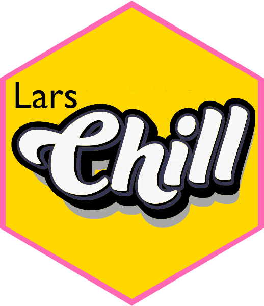

<!-- README.md is generated from README.Rmd. Please edit that file -->

```{r, include = FALSE}
knitr::opts_chunk$set(
  collapse = TRUE,
  comment = "#>",
  fig.path = "fig/README-",
  out.width = "100%"
)
```

# LarsChill 

<!-- badges: start -->
[](https://lifecycle.r-lib.org/articles/stages.html#experimental)
[](https://doi.org/10.5281/zenodo.15174333)


<!--[](https://CRAN.R-project.org/package=hexsession)>
<!-- badges: end -->

`LarsChill` is a collection of customized functions that supplement the chillR package. 

## Installation

You can install the development version of evalpheno like so:

```{r, eval=FALSE}
install.packages('devtools')
devtools::install_github('https://github.com/larscaspersen/addition_chillR')
```

## 